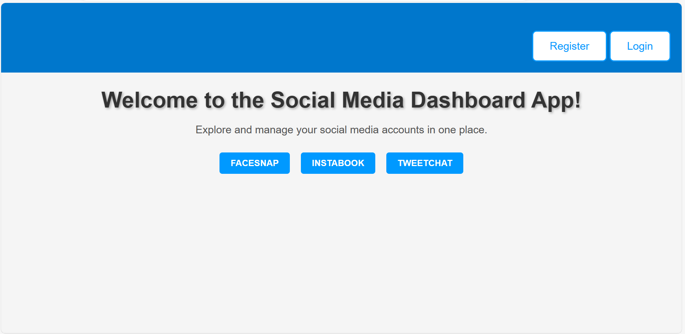

# Project Overview: Scenario and Review Criteria

## Project Overview

In your final project, you'll have the opportunity to apply and showcase your skills in Node.js, database management, and JWT authentication by developing a Social Media Dashboard application. This project will serve as a practical demonstration of your abilities in these key areas.

#### SCENARIO

In this project, you'll take on the role of a back-end developer contributing to the development of a Social Media Integration Platform. Your primary responsibilities include implementing user authentication, handling posts, and ensuring the secure management of user data within the context of a social networking environment.

Your back-end application should offer the following features and functionalities that enable users to:

* Allow users to register using distinct usernames and emails, employing secure authentication through JSON Web Tokens (JWT) for managing sessions.
* Access to the post creation function is granted only after successful login.
* Users can effectively create, edit, and delete posts.
* Pagination functionality is integrated for user convenience.

The Social Media Dashboard application page should look like the image below:

#### About this Assignment

In the Mark ungraded assignment, you will answer the questions based on the final project. The assignment aims to test you on all the skills that you learned in this course and have used in doing the project. Please ensure that you have completed the project before you proceed to answer the questions.This assignment carries 10 points.

1. Copy and paste the output of the curl command used to register a new user. (1)
2. Copy and paste the output of the curl command used to register with existing user details. (1)
3. Copy and paste the output of the curl command used to log in with registered credentials. (1)
4. Copy and paste the output of the curl command used to log in with an incorrect password.(1)
5. Copy and paste the user registration code after replacing the JSON response with res.redirect (1)
6. Copy and paste the user login code after replacing the JSON response with res.redirect.(1)
7. Copy and paste the line of code from the authenticateJWT function that validates the token and handles failure.(1)
8. Copy and paste the line of code from the "/register" endpoint that sets the JWT token to expire in one hour.(1)
9. Copy and paste the line of code from the "/post" endpoint that validates posts to ensure they're non-empty strings.(1)
10. Copy and paste the line of code from the "/logout" endpoint that removes the session on logout.(1)
